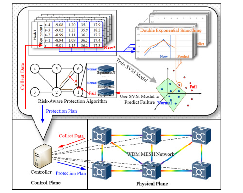
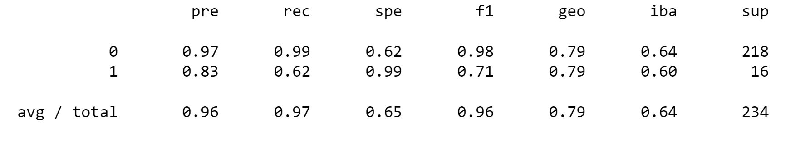
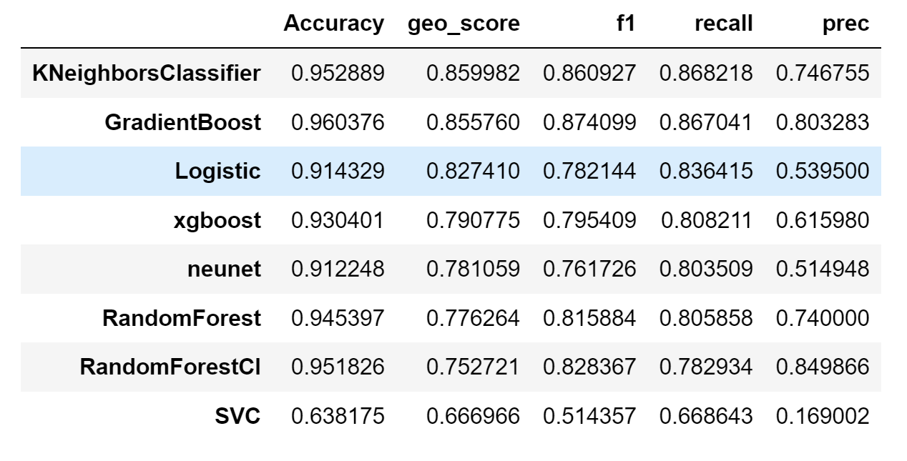
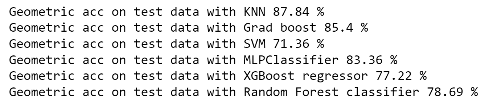

# Possibility of Device Failure

  

This project explores the application of predictive maintenance techniques using machine learning algorithms and neural networks to predict device failures. The goal is to identify the best model for analyzing historical data and determining the appropriate maintenance strategy, ultimately improving operational efficiency and reducing maintenance costs.

## Dataset
The data contains information about 7 devices, each of which has a register information of 9 sensors.

  

The dataset has 124K rows and 12 columns (Date, Device_ID, 9 sensors, and Fail), is unbalanced, and some of the sensors contain very sparse values, and some have a high correlation, but all values are integers. 

## Results
Results of the classification using Random Forest Classifier:

  

Results of the classification using multiple ML algorithms:

  

GEO results using the same models:

  

